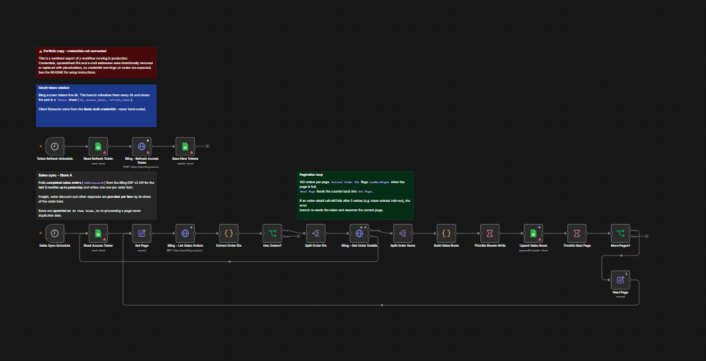
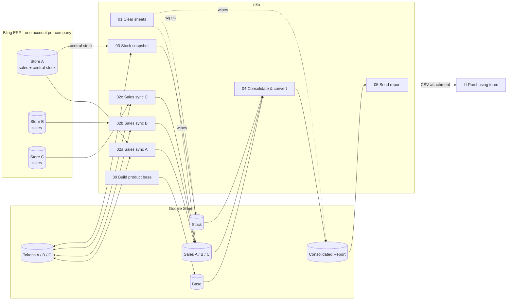
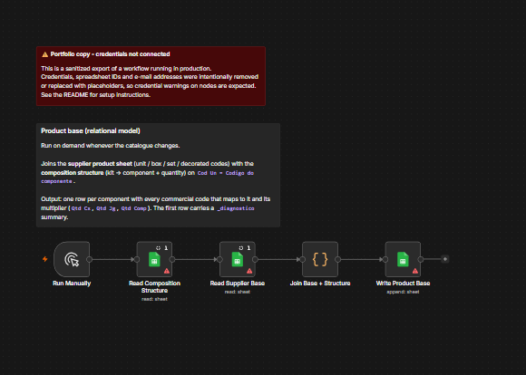
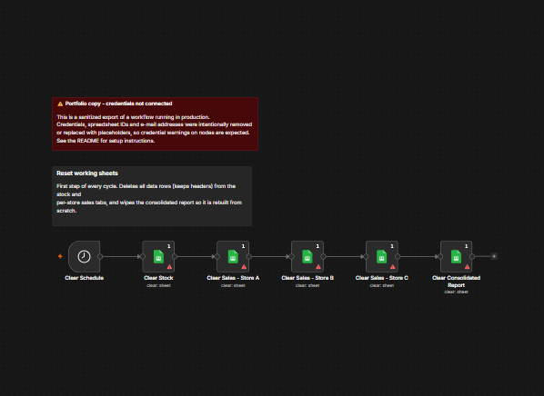
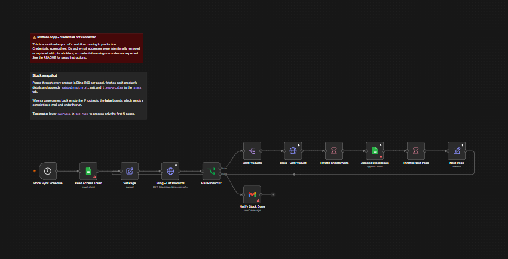
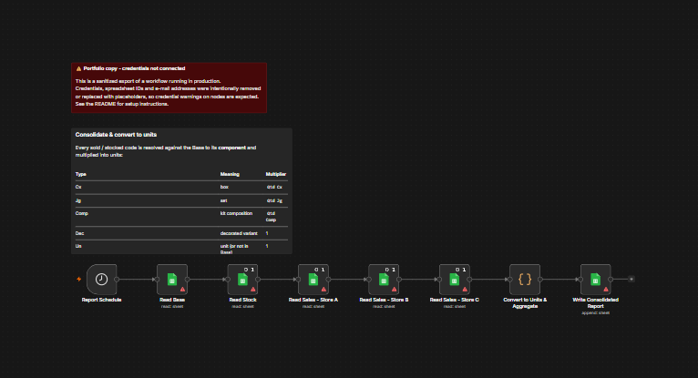
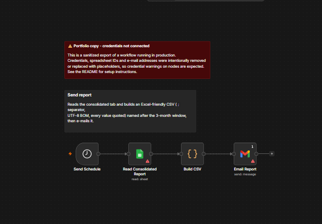

# Sales × Stock Replenishment Report — n8n + Bling ERP


An n8n automation, **running in production** for a retail group made of **three companies**, each with
its own Bling ERP account, **sharing a single stock** held by one of them. Every week it pulls three
months of sales from all three companies plus the current stock, normalises every commercial code
(boxes, sets, kits, decorated variants) back to its **base unit**, crosses the combined sales against
the central stock, and e-mails a consolidated CSV that the purchasing team uses to decide what to reorder.

**Stack:** n8n · Bling ERP REST API v3 (OAuth2) · Google Sheets · Gmail · JavaScript (Code nodes) · Node.js test runner · GitHub Actions
**Role:** freelance project, designed, built and maintained end to end, from requirements with the client to production.

> Client names, spreadsheet IDs, e-mail addresses and credentials have been removed or replaced
> with placeholders. The business logic is the production logic.


<sub>Sales sync for one store: OAuth token rotation (top) and the paginated order → item → sheet loop (bottom).</sub>

---

## The problem

The client sells the same physical product under many codes:

| Code sold | What it actually is |
|---|---|
| `CP350` | 1 glass |
| `CP350-JG6` | a **set** of 6 glasses |
| `CP350-CX24` | a **box** of 24 glasses |
| `KIT-BAR` | a **kit** containing 4 glasses + 2 wine glasses |

On top of that, the group operates as **three separate companies**, each with its own Bling account:

- **Sales are split** across three accounts and three APIs.
- **Stock is centralised** in one of them (Company A), which supplies all three.
- **Each ERP reports every code separately**, and only for its own company.

Answering *"across the whole group, how many glasses did we sell in the last 3 months, and how
many do we have in stock?"* used to be a manual exercise of exporting and merging spreadsheets.

> In the workflows the three companies are labelled **Store A / B / C**. Store A is the company that holds the stock.

## What the automation delivers

One row per **component**, with the three companies' sales summed and broken down by how each item
was sold, all converted to units and shown next to the central stock:

```text
Cod Componente | Descricao             | Qcx | Cx | Jg  | Dec | Un | Comp | On  | Total | Media M | Qtd Estoque Jg | Qtd Estoque CX_UN | Total Estoque | Encontrado na Base
CP350          | Copo Long Drink 350ml | 24  | 72 | 132 | 0   | 0  | 44   | 176 | 248   | 83      | 240            | 310               | 550           | Sim
PR27           | Prato Raso 27cm       | 12  | 0  | 54  | 14  | 37 | 0    | 0   | 105   | 35      | 90             | 128               | 218           | Sim
```

Full example (generated from fake data by the real code): [`docs/sample-report.csv`](docs/sample-report.csv).
Column headers are in Portuguese because that is what the client's team reads. The columns are
explained in [Unit conversion rules](#unit-conversion-rules-04).

## Architecture



### Weekly schedule

| Monday | Workflow | Why this slot |
|---|---|---|
| 01:00 | `01` Clear sheets | Start from empty tabs |
| 02:00 | `02a` / `02b` / `02c` Sales sync | The three companies run in parallel, each on its own Bling account |
| 04:00 | `03` Stock snapshot | The stock lives in the Store A account, so it waits for Store A sales to finish instead of competing for the same rate limit |
| 07:00 | `04` Consolidate | Hours of slack after the syncs |
| 08:00 | `05` Send report | The report is in the purchasing team's inbox at the start of the week |
| every 4 h | Token refresh (inside each `02`) | Bling access tokens expire after 6 h |
| manual | `00` Build product base | Only when the catalogue changes |

## Workflows

| File | Purpose |
|---|---|
| [`00-build-product-base.json`](workflows/00-build-product-base.json) | *Manual.* Joins the supplier product sheet with the kit composition sheet into a relational **Base**: every commercial code → component + multiplier. |
| [`01-clear-sheets.json`](workflows/01-clear-sheets.json) | Resets the working tabs (keeps headers) so each cycle starts clean. |
| [`02a`](workflows/02a-sales-sync-store-a.json) / [`02b`](workflows/02b-sales-sync-store-b.json) / [`02c`](workflows/02c-sales-sync-store-c.json) `-sales-sync-store-*.json` | Paginates Bling `pedidos/vendas` (completed orders, last 3 months), fetches each order, explodes it into one row per item and **prorates freight, discount and other expenses** by each item's share of the order. Also keeps the store's OAuth token fresh. |
| [`03-stock-snapshot.json`](workflows/03-stock-snapshot.json) | Paginates Bling `produtos` in the **Store A account, where the group's stock is held**, and records the virtual stock balance, unit and items-per-box of every product. |
| [`04-consolidate-report.json`](workflows/04-consolidate-report.json) | The core: merges the three companies' sales with the central stock, resolves every code against the Base and converts it to units (see below). |
| [`05-send-report.json`](workflows/05-send-report.json) | Builds an Excel-friendly CSV (`;`, UTF-8 BOM, all values quoted) named after the 3-month window and e-mails it. |

### Screenshots

<sub>Taken from a sandbox instance. Credentials are intentionally not connected, so the warning icons on the nodes are expected.</sub>

<details>
<summary><b>00 · Build product base</b></summary>


</details>

<details>
<summary><b>01 · Clear sheets</b></summary>


</details>

<details>
<summary><b>02 · Sales sync (one per store)</b></summary>


</details>

<details>
<summary><b>03 · Stock snapshot</b></summary>


</details>

<details>
<summary><b>04 · Consolidate & convert to units</b></summary>


</details>

<details>
<summary><b>05 · Send report</b></summary>


</details>

### Unit conversion rules (`04`)

Each code is looked up in the Base. When one code matches more than one relationship, the
priority is **Cx → Jg → Dec → Un → Comp**, and ties go to the larger multiplier.

| Type | Meaning | Units per code sold |
|---|---|---|
| `Cx` | box | `Qtd Cx` |
| `Jg` | set | `Qtd Jg` |
| `Comp` | component inside a kit | `Qtd Comp` |
| `Dec` | decorated variant of the same item | 1 |
| `Un` | the unit itself, or a code not in the Base | 1 |

Other columns:

- **`Qcx`**: units per box, for reference when placing the order.
- **`On`**: units sold through online channels, taken from orders that have a marketplace store number (`numeroLoja`).
- **`Total` / `Media M`**: total units sold in the window, and the monthly average rounded up.
- **Stock**: converted the same way. Units held as sets are also split out (`Qtd Estoque Jg`).
- **Codes missing from the Base**: stock is still counted, using Bling's `itensPorCaixa`, and the row is flagged `Encontrado na Base = Nao` so the catalogue can be fixed.

## Design decisions

**Independent scheduled workflows instead of an orchestrator with sub-workflows.** Each step is
its own workflow with its own schedule, deliberately:

- **Failures stay local.** If Store B's sync fails, the other stores and the stock snapshot still complete.
- **Each step can be re-run alone** from the n8n UI, without repeating the whole cycle.
- **Each workflow is small** enough to read, test and hand over on its own.

The trade-off is that the schedule does not know whether the previous step finished. That is
mitigated by fixed weekly slots on the same weekday with hours of slack, by retries on every
external call, and by the stock snapshot running only after Store A's sales, since both use the
same account. Fixed weekday slots are used instead of "every N days" intervals because an
interval counts from when each workflow was activated, so independent workflows drift apart
over time, while fixed slots keep the order the same every week.

**Google Sheets as the data layer.** The client already works in spreadsheets, so every
intermediate table can be inspected and corrected by the team without touching n8n.

**Upserts over appends for sales.** Each row is keyed on the order-item ID, so a page that is
re-processed after a failure cannot create duplicates.

## Engineering notes

- **Rate limits:** Bling allows 3 requests per second. Per-item calls are batched at one request every 400 ms, and every external call retries 5 times with a 5 s backoff.
- **Secrets stay out of the workflow JSON:** the Bling client ID and secret live in an n8n *Basic Auth* credential, and Google and Gmail use OAuth2 credentials.
- **Pagination:** a counter loop (`Set Page → … → More Pages? → Next Page`) with the page size defined in a single place.
- **Defensive parsing:** the Code nodes match column headers accent- and case-insensitively, accept the Brazilian `1.234,56` number format and fail with explicit messages when an input tab is empty.

## Tests & CI

`tests/workflows.test.mjs` runs without an n8n instance. It checks two things.

**Structure of every workflow:**
- connections and `$('Node')` references point to real nodes;
- no node is left disconnected;
- exports are inactive;
- the three store workflows share identical logic.

**Behaviour of the Code nodes, run against fixtures:**
- box, set and kit conversion;
- online-sales attribution;
- Brazilian number parsing;
- stock conversion;
- freight and discount proration;
- pagination flags;
- CSV escaping;
- the Base join.

```bash
node --test                      # 18 tests
node scripts/check-secrets.mjs   # secret / private-data scan
```

Both run on every push through [GitHub Actions](.github/workflows/ci.yml).

The secret scanner blocks any of the following:
- Basic or Bearer tokens, session cookies and private keys;
- Google Sheets URLs or IDs;
- real e-mail addresses;
- n8n credential IDs and instance metadata;
- any term in a local, git-ignored `.secret-denylist`.

It also runs as a pre-commit hook:

```bash
git config core.hooksPath .githooks
```

## Setup

1. **Import** every file from `workflows/` into n8n (*Workflows → Import from file*).
2. **Create the credentials:**
   - `Google Sheets account` (OAuth2)
   - `Gmail account` (OAuth2)
   - `Bling App - Store A/B/C` (*Basic Auth*: user = Bling client ID, password = client secret)
3. **Create the spreadsheets** and replace every `YOUR_…_SPREADSHEET_ID` placeholder:

   | Placeholder | Tabs |
   |---|---|
   | `YOUR_MAIN_REPORT_SPREADSHEET_ID` | `Base`, `Stock`, `Sales Store A/B/C`, `Consolidated Report` |
   | `YOUR_TOKEN_SPREADSHEET_ID_STORE_A/B/C` | `Tokens`, with headers `id`, `access_token`, `refresh_token`, seeded with row `id = 1` from the first OAuth consent |
   | `YOUR_PRODUCT_MASTER_SPREADSHEET_ID` | `Supplier Base`, `Composition Structure` |
   | `YOUR_PRODUCT_BASE_SPREADSHEET_ID` | `Base`: output of workflow `00`. Workflow `04` reads the `Base` tab of the main spreadsheet, so copy the result there, or point `00` at that tab |

4. **Set the recipients** in `05 Send Report → Email Report`.
5. **Activate** the workflows. The schedules already follow the weekly order above.

## Repository layout

```text
workflows/   n8n exports, numbered in execution order
tests/       structure + Code node tests (node --test)
scripts/     check-secrets.mjs (pre-commit + CI)
docs/        screenshots and a sample report generated from fake data
.githooks/   pre-commit hook
```

## Roadmap

- Replace the token spreadsheet with n8n's native **OAuth2 credential** for Bling, which refreshes tokens automatically and removes the refresh branches.
- Merge the three store workflows into one **parameterised sub-workflow**, since the tests already guarantee they are identical.
- Add an **error workflow** that alerts on failures, which closes the main gap of independent schedules.
- Add an optional *Execute Workflow* entry point to run a whole cycle on demand.

---

<sub>© All rights reserved. Shared for portfolio purposes; not licensed for reuse.</sub>
